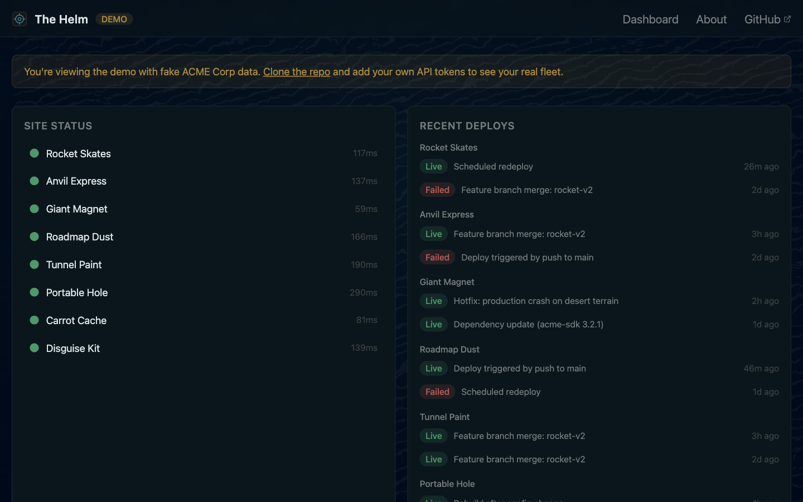

# The Helm

[](LICENSE)
[](https://nodejs.org)

Open-source fleet dashboard for indie developers who run multiple sites.

One screen. Four panels. Your API tokens stay on your machine.

**[See it live →](https://thehelm.fyi)** (demo mode, fake ACME Corp data)



## What it monitors

- **Site Status** — HTTP HEAD checks with latency, live updates via SSE
- **Recent Deploys** — Netlify deploy history per site
- **Database Projects** — Database project health and status (demo mode)
- **Git Activity** — Latest commits, staleness, open issues (GitHub GraphQL)

## Quick start

Requires **Node.js 20** or later.

```bash
git clone https://github.com/centricle/thehelm.git
cd thehelm
cp .env.example .env
# Edit .env with your API tokens
npm install
npm start
# → http://localhost:7040
```

## Demo mode

See it with fake data before adding your tokens:

```bash
DEMO_MODE=true npm start
```

The demo uses ACME Corp sample data — same dashboard, same HTMX patterns, no API calls.

## Configuration

All config lives in `.env`. See `.env.example` for the full reference.

**Sites to monitor** (pipe-separated name|value, comma-separated entries):
```
HELM_SITES=My App|https://myapp.com,Blog|https://blog.example.com
HELM_NETLIFY_SITES=My App|site-uuid-here
HELM_GITHUB_REPOS=My App|owner/repo
```

**API tokens:**
- `NETLIFY_AUTH_TOKEN` — [Netlify personal access token](https://app.netlify.com/user/applications#personal-access-tokens)
- `GITHUB_TOKEN` — [GitHub PAT with repo scope](https://github.com/settings/tokens)

Each panel works independently. Skip any token you don't need.

## Stack

| Layer | Choice |
|-------|--------|
| Server | Express 5 |
| Templates | EJS |
| Interactivity | HTMX 2.x + SSE |
| CSS | Tailwind 4 |

Two npm dependencies. HTMX is vendored, not installed at runtime. Server renders HTML, HTMX swaps it in.

## Development

```bash
npm run css:build    # One-time CSS compile (runs automatically on npm start)
npm run dev          # Express with --watch
npm run css          # Tailwind CLI in watch mode (separate terminal)
```

## Contributing

Small project, solo maintainer. Issues welcome, PRs if they're tight.

## License

MIT
